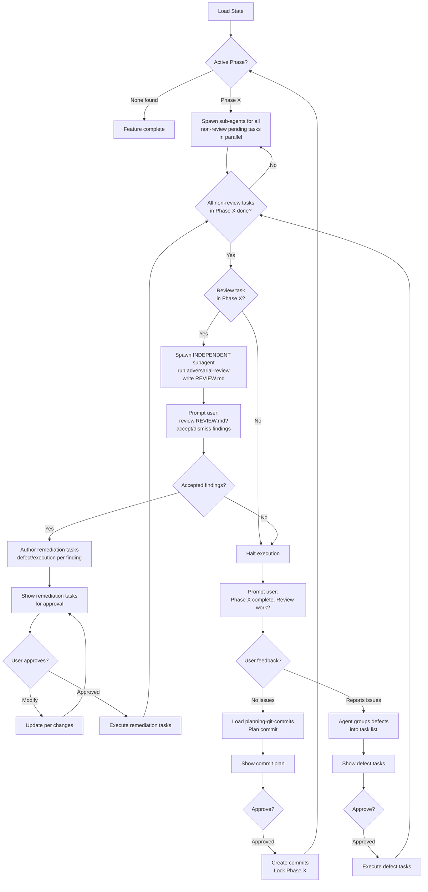

# When To Use

Use when a feature spec exists in `.agents/features/<name>/` and its tasks need implementation. The agent reads the feature state, determines the active phase, and resumes or begins execution — always operating per-phase, spawning sub-agents for all pending tasks in parallel.

> **Prerequisite**: Load the [executing-skills](../executing-skills/SKILL.md) skill before running this pipeline. It governs how skills are loaded, executed, and verified.

# Pipeline

## 1. Load State

- Locate `.agents/features/<name>/`.
- Read FEATURE.md, all TASK.md files — note `type`, `depends-on`, `status`.
  - Read each task's MEMORY.md and, if present, its GATES.md.
- Map tasks as: `complete`, `in-progress`, `pending`, `blocked` — the canonical status enum defined in [authoring-feature-spec](../authoring-feature-spec/SKILL.md). Do not invent other status values (e.g. `defect`).
  - Determine active phase: the first phase with any pending/in-progress tasks.
  - If a task has `type: defect` child tasks that are still `pending` or `in-progress`, set the parent task's `status: blocked` (per the canonical enum in authoring-feature-spec) and do not treat it as actionable until those children close. (Resolves REVIEW.md F6.)

## 2. Execute Phase

Spawn sub-agents for pending tasks in the active phase, in dependency order:

- **`interruptor` = hard stop.** Do NOT spawn an `interruptor` in parallel with other work. When an `interruptor` task is pending, halt the phase, present its context, and await the user's decision before spawning any subsequent tasks. (Resolves REVIEW.md F1.)
- **`review` tasks are excluded** from the parallel spawn — they run after the non-review tasks complete (see Step 4) via an independent subagent.
- **`planning` tasks must wait** for any in-phase `exploratory`/`execution`/`defect` tasks listed in their `depends-on` to reach `complete` before being spawned; do not run them in parallel with unfinished dependencies. (Resolves REVIEW.md F2.)
- All other pending tasks whose `depends-on` is satisfied may run in parallel.

Sub-agents MUST read the `MEMORY.md` of any tasks listed in their `depends-on` frontmatter to ingest prior context and handoff instructions. Apply [caveman-compression](../caveman-compression/SKILL.md) **only to free-form prose** when writing files — never compress frontmatter or MEMORY.md `Handoff`/`Deviations`/`Requirements` sections (see REVIEW.md F3).

## 3. Execute Based on Task `type`

Each task's `type` (in TASK.md frontmatter) determines behavior:

| type | Behavior |
|---|---|
| **exploratory** | Scout — read code, map dependencies. Reference `finding-references` if reference source/docs exist locally. Store findings in MEMORY.md. |
| **planning** | Ingest exploration context from MEMORY.md. Design approach, update TASK.md, spawn new tasks if needed. May have GATES.md verifying facts. |
| **execution** | Write/modify code. May optionally have GATES.md for validation (test, lint, format). |
| **interruptor** | Hard stop. Present context, ask user question. Complete only after user answers. |
| **defect** | Fix bugs from phase reviews. Same as execution, focused on `related-tasks`. |
| **review** | Run by an **INDEPENDENT subagent** (never the agents that authored/executed the phase). Execute the `adversarial-review` skill over the completed phase and write findings to `REVIEW.md`. Block completion on human review of `REVIEW.md`; accepted findings become `defect`/`execution` remediation tasks. |

Before executing a task, check the `FEATURE.md` task table's `Gates` column. If `Yes`, the sub-agent must execute and pass `<task-dir>/GATES.md` before marking the task complete.

## 4. End-of-Phase Review & Defect Loop

When all **non-review** tasks in the current Phase complete:

1. **Halt execution.**
2. **If the phase contains a `review` task** → run the independent-subagent review flow:
       - Spawn an **independent subagent** (distinct from any agent that authored or executed tasks in this phase) to execute the `adversarial-review` skill over the completed phase. The subagent writes its findings to `REVIEW.md` in the `review` task directory.
       - **Prompt user:** "Phase <X> review ready. Review `REVIEW.md`?" Present the findings.
       - For each **accepted** finding, author a remediation task (`type: defect` or `execution`) referencing the finding. Determine the new task ID by scanning existing tasks in the active phase and incrementing the highest number.
       - For each **dismissed** finding, record the reason in `REVIEW.md` under Human Review.
       - Create the remediation task directories (`<PHASE_LETTER><NN>-<name>/`) within the active phase namespace. Do not nest tasks inside other task directories.
       - Update the Task Table in `FEATURE.md` to include the remediation tasks.
       - Present the remediation task list to the user for approval or modification; iterate until approved.
       - **Execute remediation tasks** with sub-agents (same as step 2), then loop back to this step until no accepted findings remain.
       - Mark the `review` task complete only after the human has reviewed `REVIEW.md` and all accepted findings are either closed or tracked.
3. **Prompt user:** "Phase <X> complete. Review work?" (manual catch-all beyond the `review` task).
4. **If user reports issues** → agent groups reported issues into defect tasks:
       - Each defect task gets `type: defect`, `originator: defect:<parent-task-id>` linking to the originating task in the same phase.
       - Determine the new task ID by scanning the existing tasks in the active phase (e.g., A01, A02) and incrementing the highest number (e.g., A03).
       - Create a standard task directory (`<PHASE_LETTER><NN>-<name>/`) for each defect task within the active phase namespace. Do not nest tasks inside other task directories.
       - Update the Task Table in `FEATURE.md` to include the newly appended defect tasks.
       - Present the generated defect task list to the user for approval or modification.
       - Iterate until user approves the proposed defect tasks.
5. **Execute defect tasks** with sub-agents (same as step 2).
6. **Loop back** to step 3 (review again) until user reports no issues.

## 5. Per-Phase Commit

Once user approves phase with no issues:

1. Load [planning-git-commits](../planning-git-commits/SKILL.md).
2. Plan commits and show plan to user.
3. Wait for user approval or modification requests.
4. Iterate until user approves.
5. Create commits, lock phase, proceed to next phase.

# Reference

- **GATES.md**: [GATES.md](GATES.md) (MUST READ)
- **[authoring-feature-spec](../authoring-feature-spec/SKILL.md)** — Authoring pipeline for feature specs with phased task breakdown and validation gates
