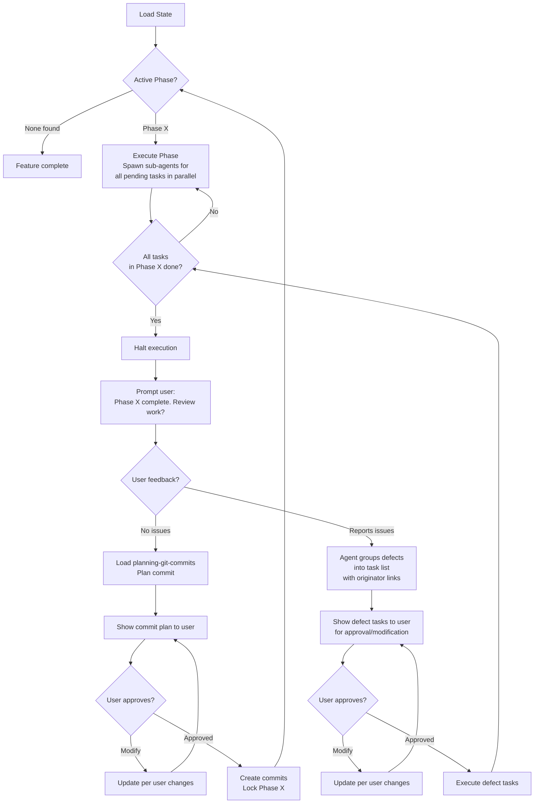

# When To Use

Use when a feature spec exists in `.agents/features/<name>/` and its tasks need implementation. The agent reads the feature state, determines the active phase, and resumes or begins execution — always operating per-phase, spawning sub-agents for all pending tasks in parallel.

> **Prerequisite**: Load the [executing-skills](../executing-skills/SKILL.md) skill before running this pipeline. It governs how skills are loaded, executed, and verified.

# Pipeline

## 1. Load State

- Locate `.agents/features/<name>/`.
- Read FEATURE.md, all TASK.md files — note `type`, `depends-on`, `status`.
- Read MEMORY.md and any GATES.md.
- Map tasks as: complete, in-progress, pending, blocked.
- Determine active phase: the first phase with any pending/in-progress tasks.

## 2. Execute Phase

Spawn sub-agents for all pending tasks in the active phase in parallel (respecting `depends-on` within the phase). Sub-agents MUST read the `MEMORY.md` of any tasks listed in their `depends-on` frontmatter to ingest prior context and handoff instructions. Apply [caveman-compression](../caveman-compression/SKILL.md) when writing to MEMORY.md, TASK.md, or any generated files.

## 3. Execute Based on Task `type`

Each task's `type` (in TASK.md frontmatter) determines behavior:

| type | Behavior |
|---|---|
| **exploratory** | Scout — read code, map dependencies. Reference `finding-references` if reference source/docs exist locally. Store findings in MEMORY.md. |
| **planning** | Ingest exploration context from MEMORY.md. Design approach, update TASK.md, spawn new tasks if needed. May have GATES.md verifying facts. |
| **execution** | Write/modify code. May optionally have GATES.md for validation (test, lint, format). |
| **interruptor** | Hard stop. Present context, ask user question. Complete only after user answers. |
| **defect** | Fix bugs from phase reviews. Same as execution, focused on `related-tasks`. |

Before executing a task, check the `FEATURE.md` task table's `Gates` column. If `Yes`, the sub-agent must execute and pass `<task-dir>/GATES.md` before marking the task complete.

## 4. End-of-Phase Review & Defect Loop

When all tasks in current Phase complete:

1. **Halt execution.**
2. **Prompt user:** "Phase <X> complete. Review work?"
3. **If user reports issues** → agent groups reported issues into defect tasks:
      - Each defect task gets `type: defect`, `originator: defect:<parent-task-id>` linking to the originating task in the same phase.
      - Determine the new task ID by scanning the existing tasks in the active phase (e.g., A01, A02) and incrementing the highest number (e.g., A03).
      - Create a standard task directory (`<PHASE_LETTER><NN>-<name>/`) for each defect task within the active phase namespace. Do not nest tasks inside other task directories.
      - Update the Task Table in `FEATURE.md` to include the newly appended defect tasks.
      - Present the generated defect task list to the user for approval or modification.
      - Iterate until user approves the proposed defect tasks.
4. **Execute defect tasks** with sub-agents (same as step 2).
5. **Loop back** to step 1 (review again) until user reports no issues.

## 5. Per-Phase Commit

Once user approves phase with no issues:

1. Load [planning-git-commits](../planning-git-commits/SKILL.md).
2. Plan commits and show plan to user.
3. Wait for user approval or modification requests.
4. Iterate until user approves.
5. Create commits, lock phase, proceed to next phase.

# Reference

- **GATES.md**: [GATES.md](GATES.md) (MUST READ)
- **[authoring-feature-spec](../authoring-feature-spec/SKILL.md)** — Authoring pipeline for feature specs with phased task breakdown and validation gates
