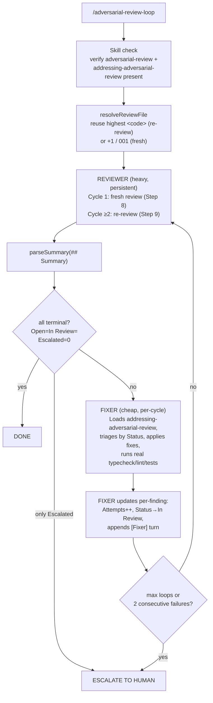
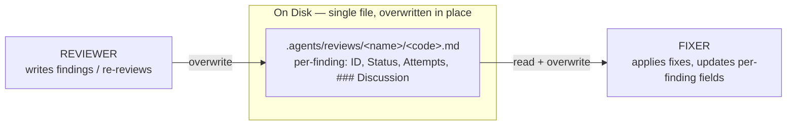
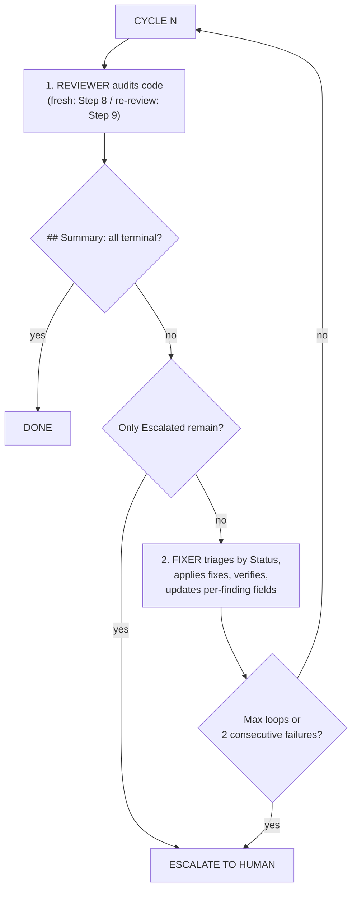

# @montflow/adversarial-review-loop

A Pi extension that runs an automated **adversarial review loop** on your codebase. Two agents collaborate in a cycle — reviewer and fixer — communicating through a shared review report file at `.agents/reviews/<name>/<code>.md` using the **adversarial-review v3 per-finding protocol** (`Status` / `Attempts` / `### Discussion`).

> **Skill compatibility**: targets `adversarial-review` v3.0.0 (reviewer) and `addressing-adversarial-review` v1.0.0 (fixer). Both skills MUST be present at `.agents/skills/adversarial-review/SKILL.md` and `.agents/skills/addressing-adversarial-review/SKILL.md`.

## How it works

The loop is an orchestration shell around the two skills. It does **not** implement review or fix logic itself — it spawns agents that load and follow the skill files as their governing pipeline. The extension owns only three things: skill availability, the cycle/escalation bookkeeping, and the shared file on disk.



The reviewer agent is **persistent** (same context across cycles, created once in `createPersistentAgent`) so it remembers prior findings. The fixer agent is **single-use** per cycle (`runAgent`) — a fresh context each pass. Both are spawned with `noSkills: true`; they reference the skill files as *data dependencies* by path and read them fresh every run, so skill updates propagate without a code change (see `runner.js` `createSession`).

## Skills → extension alignment

The extension is a thin driver. Every substantive rule lives in the skills; the code wires the skills together and enforces the protocol's termination/escalation rules.

| Concern | Owner | Where |
|---|---|---|
| What to hunt, how to write findings, re-review scoping | `adversarial-review` v3 | SKILL.md Steps 1–9, GATES.md Phase 0–4 |
| How to triage, fix, verify, escalate, format-write | `addressing-adversarial-review` v1 | SKILL.md Steps 1–6, "Fixer↔Reviewer Contract" |
| Skill presence gate | extension | `index.js:verifySkill` |
| `<name>/<code>.md` resolution (fresh vs re-review) | extension (mirrors skill Step 0) | `index.js:resolveReviewFile` |
| Cycle loop, max-loops, consecutive-failure abort | extension | `index.js:handler` while-loop |
| Termination detection (all-terminal parse) | extension | `parse-summary.js:isAllTerminal` |
| Reviewer persistence / fixer freshness, skill-as-data | extension | `runner.js` |
| Per-role prompts + tool grants | extension | `agents.js:REVIEWER_SYSTEM`, `FIXER_SYSTEM`, `TOOLS` |

The protocol's hard role boundaries (who may touch `Attempts`, `Iteration`, `Status`, `### Discussion`) are enforced by the **skills' contract**, not by the extension — the extension only reads `## Summary` to decide stop/continue. See the "Communication via the report file" section for the field-level contract.

## Agents

| Role | Model tier | Tools | Persistence | Job |
|---|---|---|---|---|
| **Reviewer** | Heavy (default: `deepseek-v4-pro`) | read, edit, write, grep, glob | Persistent across cycles | Loads `adversarial-review/SKILL.md`. Cycle 1: writes a fresh review file (Step 8) with per-finding `Status: Open`, `Attempts: 0`, empty `### Discussion`. Cycle ≥2: executes Step 9 re-review — reads only the current review file, verifies each `In Review` finding against the actual code (never trusting `[Fixer]` turns as evidence), confirms (`Resolved`) or rejects (`Open`), hunts Steps 2–7 for regressions, bumps `Iteration`, and overwrites the file in place. |
| **Fixer** | Cheap (default: `deepseek-v4-flash-free`) | read, edit, write, bash, grep, glob | Fresh each cycle | Loads `addressing-adversarial-review/SKILL.md`. Triages by Status. For each `Open` finding: ceiling-checks `Attempts >= Max Attempts` (escalates), applies a minimal fix, increments `Attempts`, verifies with the repo's real checks, sets `Status: In Review` (or leaves `Open` on failure), appends a `[Fixer]` turn to the finding's `### Discussion`, and overwrites the file. `Won't Fix` / `Escalated` do not consume an attempt. |

The reviewer — not the fixer — is the verifier under the skill protocol. The fixer performs *local* verification (typecheck/lint/tests pass) before flipping a finding to `In Review`; the reviewer then confirms the fix in the code on the next cycle. This matches the two-role contract in `adversarial-review` Step 9 and `addressing-adversarial-review` §"The Fixer↔Reviewer Contract".

## Communication via the report file

Reviewer and fixer never talk directly. They coordinate through the shared review file. The field-level ownership is the skill protocol's "Fixer↔Reviewer Contract" — the extension treats the file as opaque and only parses `## Summary`.



- The reviewer overwrites the file in place — same `<code>` across all cycles of one review session (see Step 0 of `adversarial-review`). A fresh `<code>` is only allocated when `--fresh=true` or the directory is empty. `resolveReviewFile` mirrors this: reuse the highest numeric `<code>` for a re-review, else `+1` / `001`.
- The fixer reads the file, applies fixes, and overwrites it with updated `Attempts` / `Status` / `[Fixer]` Discussion turns. `Iteration` and every reviewer-authored field are never touched by the fixer.
- The `[Fixer]` turns are *unverified assertions* — the reviewer re-derives correctness from the code on the next cycle.

**Role boundaries (per the contract):**

| Field | Reviewer | Fixer |
|---|---|---|
| `Attempts` | NEVER touch | increments by 1 per attempt |
| `Status` | `Open` (initial/reject), `Resolved` (verify) | `In Review`, `Won't Fix`, `Escalated` |
| `[Reviewer]` Discussion turns | appends only | NEVER edit/delete |
| `[Fixer]`/`[Human]` Discussion turns | NEVER edit/delete | appends only |
| `Iteration` | increments on re-review | NEVER touch |
| Severity / Location / Problem / Impact / Suggestion | writes initially | NEVER edit |

There is **no** `## Fixer Notes` section and **no** `STATUS: FIXED/FAILED/PASS/FAIL` line — those v2 conventions were removed in adversarial-review v3.0.0. The loop detects termination by parsing the file's `## Summary` block (see `parse-summary.js`): when `Open`, `In Review`, and `Escalated` counts are all zero, every finding is terminal and the loop stops (`isAllTerminal`).

## Installation

Add to your Pi project's `package.json`:

```json
{
  "pi": {
    "extensions": ["path/to/adversarial-review-loop/index.js"]
  }
}
```

Requires `@earendil-works/pi-coding-agent` as a peer dependency. The target project must have both skills installed:

- `.agents/skills/adversarial-review/SKILL.md` (v3.0.0)
- `.agents/skills/addressing-adversarial-review/SKILL.md` (v1.0.0)

## Usage

```
/adversarial-review-loop --depth=5 --reviewer-model=deepseek-v4-pro --fixer-model=deepseek-v4-flash-free
```

### Flags

| Flag | Default | Description |
|---|---|---|
| `--reviewer-model` | `deepseek-v4-pro` | Heavy model for the reviewer agent |
| `--fixer-model` | `deepseek-v4-flash-free` | Cheap model for the fixer agent |
| `--depth` / `--max-loops` | `3` | Maximum review cycles before escalation |
| `--dir` / `--target-dir` | current dir | Directory to review |
| `--name` | `adversarial` | `<name>` segment of `.agents/reviews/<name>/<code>.md` |
| `--fresh` | `false` | Allocate a new `<code>` instead of reusing the highest existing (forces a fresh review even when files exist) |

There is no `chat` or `feature-spec` output mode — adversarial-review v3.0.0 requires the review to ALWAYS be written to `.agents/reviews/<name>/<code>.md`, and the fixer↔reviewer loop depends on that shared artifact.

## Cycle logic



**Consecutive-failure handling:** if *either* the reviewer or the fixer errors, the extension increments a shared `consecutiveFailures` counter and retries the current cycle. After 2 consecutive failures by either agent, the loop aborts and escalates to the human (`MAX_CONSECUTIVE_FAILURES = 2`). A successful run by either agent resets the counter to 0.

**Escalation:**
- If the fixer hits `Attempts >= Max Attempts` on a finding, that finding is set to `Escalated` in the file and surfaces in the next reviewer cycle (the loop stops when only `Escalated` findings remain — they need human input). `Max Attempts` comes from the file's Review Metadata (default 3 per the skill).
- If either agent errors 2 consecutive cycles, the loop aborts and escalates to the human.
- When `max-loops` is reached without all findings terminal, the loop stops with a warning and points to the review file.

## Module map

| File | Responsibility |
|---|---|
| `index.js` | Extension entry. Parses flags, gates on skill presence, resolves the review file, runs the cycle loop, parses `## Summary` for termination, and handles escalation. |
| `runner.js` | Agent plumbing over `@earendil-works/pi-coding-agent`. `runAgent` (single-use, fixer), `createPersistentAgent` (reviewer), `createSession` (spawns with `noSkills: true` so agents load skills as data). |
| `agents.js` | System prompts (`REVIEWER_SYSTEM`, `FIXER_SYSTEM`) and per-role tool grants (`TOOLS`). |
| `parse-summary.js` | Pure `## Summary` parser (`parseSummaryText`) + `isAllTerminal`. Isolated for unit testing (regression for finding F15). |
| `test/` | Unit tests for `parse-summary.js`. |
